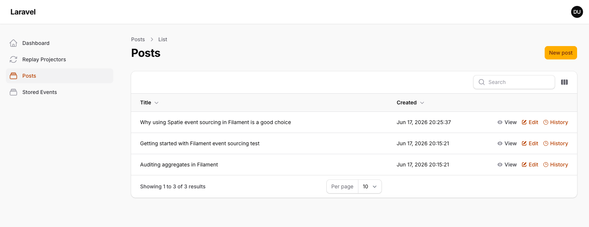
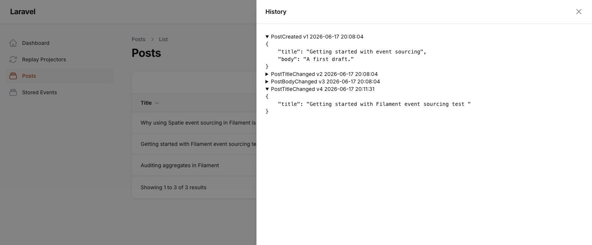
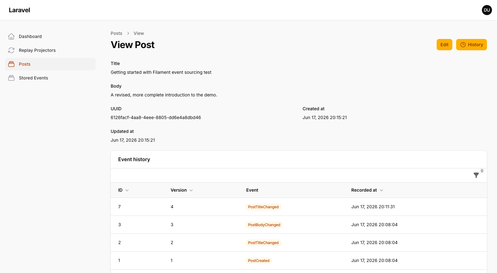
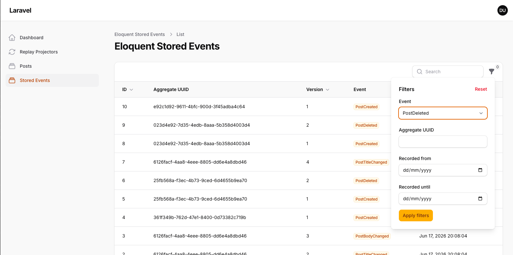
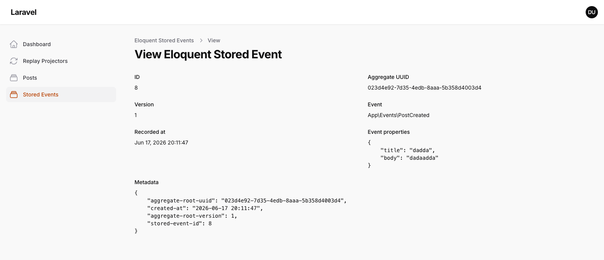
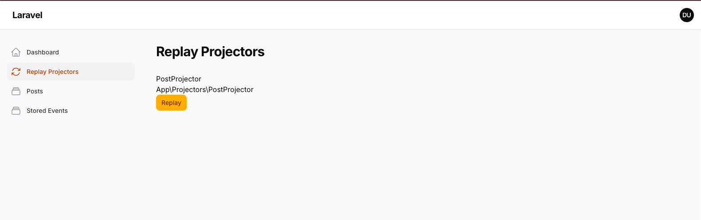
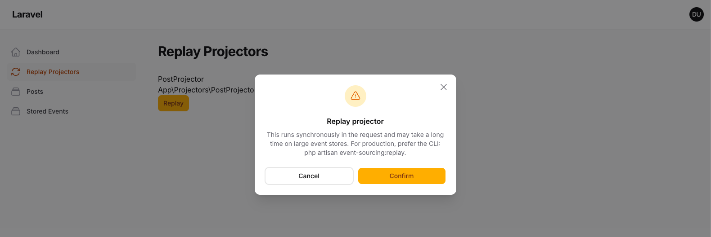
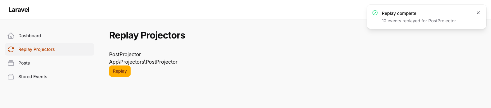

# Filament Event Sourcing Demo

A small Filament application that demonstrates
[albertoarena/filament-event-sourcing](https://github.com/albertoarena/filament-event-sourcing),
the package that integrates [spatie/laravel-event-sourcing](https://spatie.be/docs/laravel-event-sourcing/v7/introduction)
with [Filament](https://filamentphp.com) admin panels.

It models a `Post` domain end to end: writes go through a `PostAggregate`, a synchronous projector
maintains a `Post` projection, and the Filament panel uses the package's write bridge, stored
events browser, per-record event history and projector replay page.

## Stack

- Laravel `^12.0`
- Filament `^4.0`
- spatie/laravel-event-sourcing `^7.0`
- albertoarena/filament-event-sourcing `^0.1`
- SQLite (local file database)

## Getting started

```bash
git clone https://github.com/albertoarena/filament-event-sourcing-demo.git
cd filament-event-sourcing-demo
cp .env.example .env
composer install
php artisan key:generate
touch database/database.sqlite
php artisan migrate --seed
php artisan serve
```

Then open the admin panel at `/admin`, sign in with the seeded credentials below, and explore the
`Posts` resource and the `Stored Events` browser.

### Seeded login

- Email: `demo@example.com`
- Password: `password`

## What to look at

- **Posts resource**: create, edit and delete posts. Every write goes through `PostAggregate`,
  not Eloquent. The delete action uses `EventSourcedDeleteAction`.
- **Event history**: open a post and use the History action, or the Stored Events relation tab,
  to see the aggregate's events with their payloads.
- **Stored Events**: the read-only browser over every stored event, with filters.
- **Replay Projectors**: rebuild the `Post` projection from its events (enabled in config). The
  `PostProjector` implements `resetState()`, so a full replay clears and rebuilds the projection.
  Replays run synchronously in the request.

## Screenshots

**Posts list** with a per-row History action.



**Event history** slide-over listing the aggregate's events with an expandable JSON payload.



**Event history relation tab** on a single post.



**Stored Events browser**, the read-only resource over every stored event.



**Stored event view** with the pretty-printed payload.



**Replay Projectors**: select a projector, confirm, and see how many events were replayed.





## License

The MIT License (MIT).
